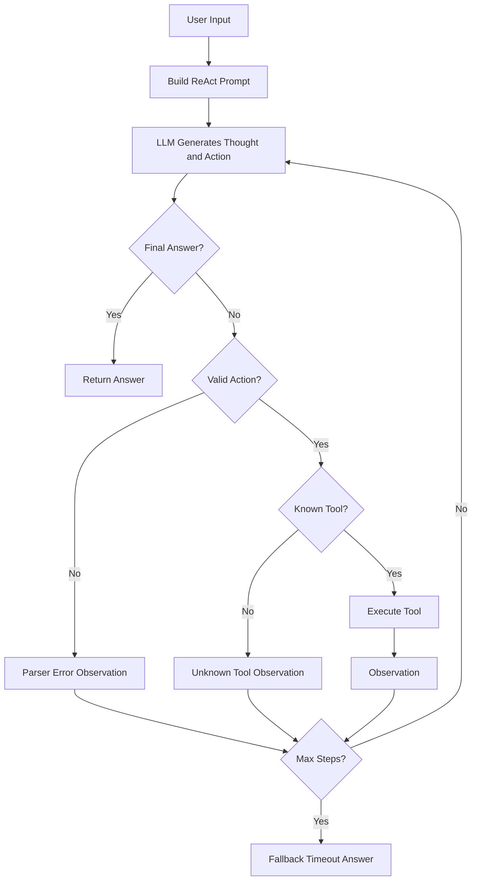

# Lab 3 Group Report: Chatbot vs ReAct Agent

## 1. Project Overview

This lab compares a direct LLM chatbot baseline with a ReAct-style agent in a healthcare triage workflow. The goal is not to provide medical diagnosis, but to study how tool use, observations, failure handling, and telemetry make an agent more reliable than a simple chatbot.

Main files:

- `src/agent/chatbot.py`: direct chatbot baseline with no tool access.
- `src/agent/agent_v1.py`: first working ReAct loop with basic tool execution.
- `src/agent/agent.py`: Agent v2 with improved parsing, recovery, and guardrails.
- `src/tools/healthcare_tools.py`: healthcare triage, care recommendation, cost estimation, and appointment preparation tools.
- `evaluate_lab.py`: scripted evaluation comparing chatbot and agent outputs.
- `analyze_logs.py`: telemetry aggregation for latency, token usage, cost estimate, tool calls, and error counts.

## 2. Chatbot Baseline

The baseline chatbot sends the user question directly to an LLM provider and returns the model response. It does not call external tools, does not validate facts, and does not inspect structured observations.

Strengths:

- Simple to implement.
- Low latency because it only performs one LLM call.
- Useful as a baseline for comparison.

Limitations:

- Can answer confidently without checking symptoms or red flags.
- Cannot recover from missing facts using tools.
- Has no explicit trace of reasoning or tool execution.

Example baseline risk from `evaluate_lab.py`:

```text
Question: A 62-year-old patient in Hanoi has chest pain and shortness of breath for 2 hours.
Chatbot response: It may be anxiety or indigestion. Consider resting and monitoring symptoms.
```

This answer is unsafe because chest pain and shortness of breath are emergency red flags.

## 3. Agent v1 Working

The ReAct agent uses an iterative loop:

1. Build a prompt containing the user question and available tools.
2. Ask the LLM for a `Thought` and `Action`.
3. Parse the action.
4. Execute the selected tool.
5. Append the tool result as an `Observation`.
6. Continue until the model produces `Final Answer` or reaches `max_steps`.

The agent uses more than two tools:

- `assess_symptom_urgency`
- `recommend_care_service`
- `estimate_visit_cost`
- `appointment_preparation`

Agent v1 can answer multi-step tasks because it can call tools before finalizing an answer. Its limitation is that it stops immediately on invalid tool names or parser errors.

## 4. Agent v2 Improved

After testing Agent v1, several likely failure modes were identified:

- The model may call a tool that does not exist.
- The model may output malformed actions.
- The model may loop without producing a final answer.
- The model may provide a healthcare answer without a safety disclaimer.

Agent v2 improvements implemented in `src/agent/agent.py`:

- `max_steps` guardrail prevents infinite loops.
- Action parser supports both function-call style and JSON action style.
- Unknown tools return a structured observation listing available tools.
- Parser errors return an observation instructing the model to use the correct format.
- Tool exceptions are caught and returned as observations instead of crashing the program.
- Healthcare prompt rules require no diagnosis and emergency escalation for red flags.
- Structured telemetry records agent steps, tool calls, parser errors, unknown tools, and final status.

## 5. Tool Design Evolution

Initial tool design idea:

```text
triage(symptoms)
```

Problem:

- Too vague for reliable evaluation.
- Does not expose useful parameters such as age or symptom duration.
- Tool result may be hard for the agent to interpret.

Improved design:

```text
assess_symptom_urgency(symptoms="chest pain and shortness of breath", age=62, duration_hours=2)
recommend_care_service(urgency="emergency", location="Hanoi")
estimate_visit_cost(service_type="urgent", insurance_status="insured")
appointment_preparation(service_type="routine")
```

Benefits:

- Clear argument names make tool calls easier to parse.
- Tool outputs use explicit labels such as `Urgency: emergency`.
- The agent can chain tools: first assess urgency, then recommend care service.
- Cost estimation and preparation tools support extra evaluation cases.

## 6. Successful Trace

Case: emergency red flags.

```text
User Question:
A 62-year-old patient in Hanoi has chest pain and shortness of breath for 2 hours. What level of care is appropriate?

Thought:
Assess red flags first.

Action:
assess_symptom_urgency(symptoms="chest pain and shortness of breath", age=62, duration_hours=2)

Observation:
Urgency: emergency. Red flags detected: chest pain, shortness of breath. This is not a diagnosis; the patient should call local emergency services or go to an emergency department now.

Thought:
Emergency red flags are present.

Action:
recommend_care_service(urgency="emergency", location="Hanoi")

Observation:
Recommended service for Hanoi: Emergency department. Call local emergency services or go to the nearest emergency department now.

Final Answer:
Emergency department is appropriate. Call local emergency services or go now. This is not a diagnosis.
```

Why it succeeds:

- The agent checks red flags before answering.
- The final answer is based on tool observations.
- The answer includes a safety disclaimer.

## 7. Failed Trace and Recovery

Case: invalid tool call.

```text
User Question:
Estimate urgent care cost with insurance.

Thought:
I will use a made-up tool.

Action:
diagnose_patient(symptoms="urgent care cost")

Observation:
Tool error: unknown tool 'diagnose_patient'. Available tools: assess_symptom_urgency, recommend_care_service, estimate_visit_cost, appointment_preparation.

Thought:
The previous tool was invalid, so use the cost estimator.

Action:
estimate_visit_cost(service_type="urgent", insurance_status="insured")

Observation:
Estimated patient cost for urgent care: 180,000 VND. This is a planning estimate, not a hospital quote.

Final Answer:
Estimated insured urgent care cost is 180,000 VND. This is a planning estimate, not a hospital quote.
```

Root cause:

- The model selected a non-existent tool name.

Fix:

- The agent did not crash. It returned a structured unknown-tool observation and allowed the model to recover on the next step.

Result:

- Agent v2 completed the task using the correct tool.

## 8. Evaluation and Analysis

Script: `evaluate_lab.py`

Evaluation cases:

| Case | Baseline Risk | ReAct Agent Behavior | Expected Result |
| :--- | :--- | :--- | :--- |
| Emergency red flags | May minimize serious symptoms | Calls urgency and care recommendation tools | Emergency care plus disclaimer |
| Routine symptoms | May give unsafe direct advice | Calls urgency or preparation tools | Routine care plus disclaimer |
| Tool recovery | Cannot use tools | Recovers from invalid tool and calls cost estimator | 180,000 VND estimate |

Expected scripted result:

| Metric | Value |
| :--- | ---: |
| Evaluation cases | 3 |
| Agent v1 successes | 2 |
| Agent v2 successes | 3 |
| Tool recovery cases | 1 |
| External API required | 0 |

The ReAct agents are slower and use more steps than the chatbot, but they are safer for multi-step tasks because they can inspect tool observations before answering. Agent v2 improves over Agent v1 by recovering from a hallucinated tool call in the cost-estimation case.

## 9. Monitoring

Telemetry is implemented in:

- `src/telemetry/logger.py`
- `src/telemetry/metrics.py`
- `analyze_logs.py`

Tracked signals:

- LLM request count
- Prompt tokens
- Completion tokens
- Total tokens
- Latency
- Cost estimate
- Tool calls
- Parser errors
- Unknown tool errors
- Max-step timeouts
- Successful agent runs

These metrics support the bonus monitoring requirement.

## 10. Flowchart



## 11. Key Insights

- A chatbot is fast and simple, but it can hallucinate or miss critical safety conditions.
- A ReAct agent is more reliable when the task requires facts, calculations, or structured decisions.
- Tool design matters as much as prompt design. Clear tool names, arguments, and outputs make the agent easier to control.
- Failure traces are valuable because they show whether the system can recover instead of silently producing a bad answer.
- Monitoring makes the lab easier to debug and gives measurable evidence for improvement.

## 12. Future Improvements

- Add a larger evaluation set with more symptom combinations.
- Add a guardrail checker that verifies the final answer includes safety disclaimers for healthcare tasks.
- Add retrieval over trusted medical guidance documents for better grounding.
- Add a dashboard for logs and metrics.
- Compare ablations: no tools vs tools, v1 parser vs v2 parser, max_steps on vs off.
